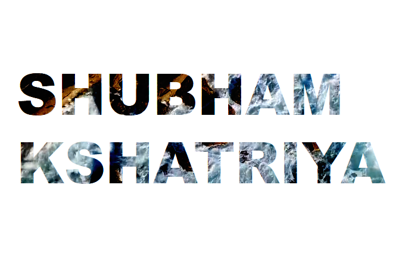

## Hello Folks 👋:bowtie:

###### My name is Shubham Kshatriya and I'm a student pursuing my Bachelor degree in Information Technology. I'm from Dahod, living in Vadodara. Some technologies I enjoy working with include Python, Django, Javascript(ES6), Bootstrap, Flutter,Java, etc. I 'm currently working on Web Dev, currently learning App Dev with Java and Flutter. Participating in Hackathons and Code Jams are my favourites and I was a finalist of Smart India Hackathon-2020(Software Edition). Apart from coding and dev, I like to pen down some blogs and some of my interests lie in Cricket, Novels and Painting.

### You can find me here!:blue_heart:
- [Linkedin ](https://www.linkedin.com/in/shubhamkshatriya25/)
- [Twitter ](https://twitter.com/shubhHAM_)
- [ Medium ](https://medium.com/@shubhamkshatriya521)

<!--
**shubhamkshatriya25/shubhamkshatriya25** is a ✨ _special_ ✨ repository because its `README.md` (this file) appears on your GitHub profile.

Here are some ideas to get you started:

- 🔭 I’m currently working on ...
- 🌱 I’m currently learning ...
- 👯 I’m looking to collaborate on ...
- 🤔 I’m looking for help with ...
- 💬 Ask me about ...
- 📫 How to reach me: ...
- 😄 Pronouns: ...
- ⚡ Fun fact: ...
-->
